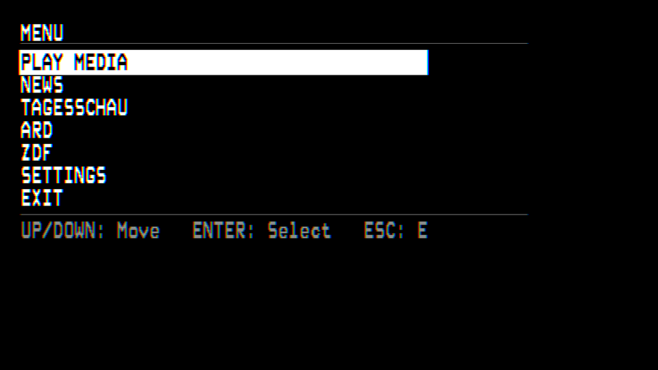
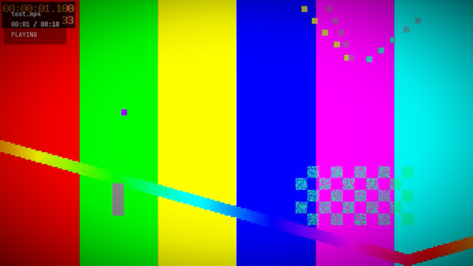
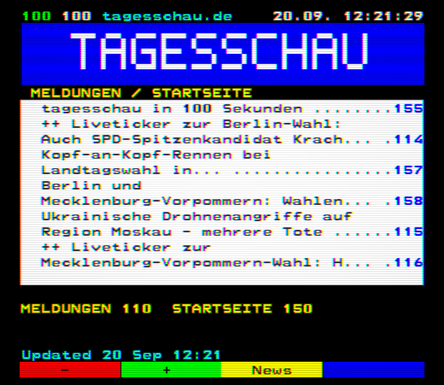
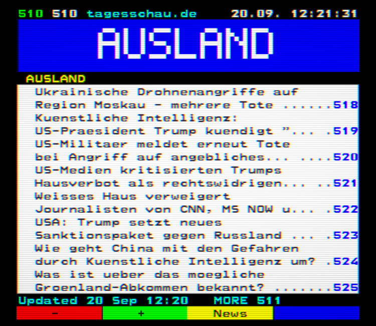
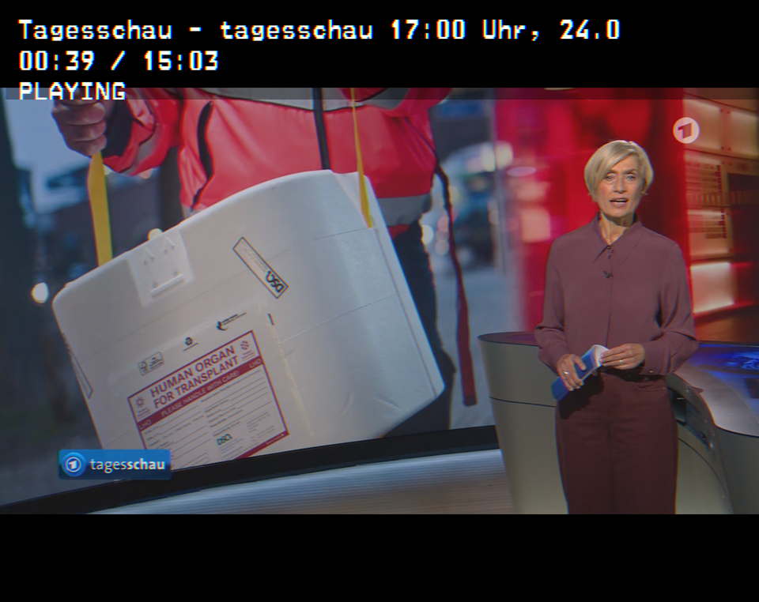

# PVM Player

A fullscreen media player prototype styled after a Sony PVM broadcast
monitor: a flat black, monospace, keyboard/remote-only on-screen menu, and
an optional CRT post-process pass (scanlines, vignette, bloom, color tear)
over whatever's playing.

<p align="center">
  
  
</p>

## Features

- **Playback** for local video and audio files via [libmpv](https://mpv.io/),
  rendered into an OpenGL texture (not a native player window)
- **PVM-style OSD menu** — root menu → file browser, fully keyboard-driven
  (no mouse required)
- **File browser**: one or more configured root folders, nested navigation
  (including *above* the configured root, up to the filesystem root), a
  configurable start directory, automatic "resume where you left off", and
  a hidden-files toggle
- **NEWS**, **TAGESSCHAU**, **ARD** and **ZDF**: teletext-style readers --
  numbered 3-digit pages on a 40x24 monospace grid. NEWS/TAGESSCHAU are fed
  by RSS/Atom sources you configure; ARD/ZDF each browse and play their own
  Mediathek's videos via the MediathekViewWeb API. All four refresh in the
  background and cache to disk (see [NEWS](#news-teletext) below)
- **CRT post-process pass**: scanlines, vignette, bloom, and a chromatic
  "color tear" effect, each independently tunable, plus always-on
  brightness/contrast/saturation controls — toggle the whole effect with
  <kbd>C</kbd>
- **Configurable look**: pick any font dropped into `assets/fonts/`
  (ships with a clean default plus an authentic teletext-style option),
  uncapped font size, 5 menu screen positions, 3 selection-highlight
  styles, and independent X/Y stretch for the menu panel and for text
- Settings persist to a plain-text `config.cfg` next to the executable
- **Stays awake during playback** (macOS): the display's idle-sleep timer is
  held off while a video is actively playing (not while paused, or on any
  other screen), so the screen doesn't blank mid-movie on battery power

## Building

Requires CMake 3.20+, a C++17 compiler, [libmpv](https://mpv.io/)
(e.g. `brew install mpv` on macOS, or vendor a prebuilt Windows SDK under
`thirdparty/libmpv/`), and libcurl (bundled with macOS; `libcurl4-openssl-dev`
on Debian/Raspberry Pi OS). [pugixml](https://pugixml.org/) is used from the
system if installed (`brew install pugixml` / `apt install libpugixml-dev`)
and otherwise fetched and built automatically. GLFW, glad, Dear ImGui and
[nlohmann/json](https://github.com/nlohmann/json) (the ARD section's JSON
parser) are vendored/fetched automatically.

```sh
cmake -S . -B build
cmake --build build -j
```

## Usage

```sh
./build/pvm_player [directory ...]
```

Pass one or more directories to browse via the "Play Media" menu entry;
defaults to the current directory. Multiple directories show a root
picker; the "Start Directory" setting is a simpler single-folder default
for everyday use.

| Key(s)              | Action                                    |
|----------------------|--------------------------------------------|
| ↑ / ↓                | Move selection                             |
| Enter                | Select / open / play                       |
| Esc / Backspace       | Back / stop playback / exit                |
| Space                 | Play / pause                               |
| ← / →                 | Seek ±5s (playback) or adjust a setting     |
| C                     | Toggle the CRT effect                      |

## NEWS (teletext)

The root menu's **NEWS**, **TAGESSCHAU** and **ARD** entries each open a
teletext-style reader: a 40x24 character grid (the World System Teletext
geometry) in the eight teletext colors, using whichever font is selected in
Settings (the teletext-style fonts under `assets/fonts/` suit it best). 

**Pages.** 100 is the index. Each configured source owns a block of pages:
its first page is a headline list, the following pages hold articles
(newest first, long ones continue across pages, capped at
`max_article_pages`). When a block is full the oldest articles are dropped.

| Key(s)                | Action                                                        |
|------------------------|----------------------------------------------------------------|
| ↑ / ↓                  | Move the highlighted selection among this page's links (a headline, a category, a show, an episode) |
| Enter                  | Activate the selected link: jump to a page, or (ARD) play an episode |
| ← / →                  | Previous / next *page number* (skipping unpopulated numbers) -- on ARD, turns a page's own sub-pages first (see [ARD](#ard)) |
| 0-9 (or keypad 0-9)    | Type a page number; jumps on the 3rd digit                    |
| Red / Green (F1 / F2, or R / G) | `-` previous page / `+` next page, same as ←/→        |
| Yellow (F3 or Y), M    | `News`: the index, page 100                                   |
| Blue (F4 or B)         | `Refresh`: re-fetch this section right now, bypassing its normal timer/cache |
| Esc / Backspace        | Back: cancels a half-typed number, else climbs a level, else leaves the section |

A page number nobody has typed a third digit for is abandoned after 3 seconds.
A number with no page behind it shows a "PAGE NOT FOUND" placeholder.

**Sources** are listed in `news.cfg` next to the executable (the build ships
a starter copy as `news.default.cfg`, from [`conf/news.cfg`](conf/news.cfg);
copy it to `news.cfg` to edit it):

```
refresh_minutes=15
block_size=10
max_article_pages=3
source=110 | WORLD | https://feeds.bbci.co.uk/news/world/rss.xml | bbc.co.uk | BBC NEWS
```

A source is `start page | CATEGORY | feed URL`, optionally followed by
`| provider` (the cyan header text; defaults to the URL's host) and
`| LOGO` (the title-art text, up to 13 letters/digits; defaults to the
category).

**Refreshing and caching.** Feeds are fetched on a background thread (never
on the render loop, so video playback is unaffected), one source at a time,
no more often than every 5 minutes. The last good copy of every feed is
kept in `cache/news/` next to the executable, so the section has pages
immediately at startup and keeps working offline. The page-100 footer shows
when the news was last updated, and flags sources that are failing.

Feed quality varies a lot: some feeds carry only a one-line teaser per
story, others (e.g. Ars Technica) the first several paragraphs. Check a
candidate with the probe tool before adding it:

```sh
./build/teletext_probe https://example.com/feed.xml --limit 3
./build/teletext_probe --news build/news.default.cfg 100 110   # dump pages as text
```

Only the feed URLs you configure are fetched (no page scraping, no
images), with an identifying `User-Agent`. Logic tests run with
`ctest --test-dir build`.

<a id="tagesschau"></a>
### TAGESSCHAU

<p align="center">
  
  
</p>
<p align="center"><em>Page 100 (overview) and page 510 (the Ausland section index)</em></p>

The root menu's **TAGESSCHAU** entry is a second, larger teletext service of
the same kind, built from 14 tagesschau.de feeds (configured in
[`conf/tagesschau.cfg`](conf/tagesschau.cfg), shipped as
`tagesschau.default.cfg`; copy to `tagesschau.cfg` to edit). It has its own
config, cache (`cache/tagesschau/`) and current page, and the same keys as NEWS.

| Pages   | Content                                                          |
|---------|-------------------------------------------------------------------|
| 100-199 | Meldungen (110-149), Startseite (150-199)                         |
| 200-399 | Inland (210), Innenpolitik (260), Gesellschaft (310), Regional (350) |
| 400-499 | Baden-Württemberg (410)                                           |
| 500-699 | Ausland (510)                                                     |
| 700-799 | Wirtschaft (710)                                                  |
| 800-999 | Wissen (810), Gesundheit (860), Klima & Umwelt (910), Forschung (940), Technologie (970) |

Every **hundred page** (100, 200, ... 900) is an overview: title art, the six
newest articles located in its 100-page range with their page numbers, and
the sections that have pages there. Each feed's first page is its section
index (logo banner plus headlines); article pages follow, newest first, and
never use the hundred pages -- a range like 510-699 simply passes over 600
(whose overview lists the same newest stories if the feed did not reach that
far). Esc/Backspace climbs article → section index → hundred page → page 100
→ leave.

Both sections use the same file format: `source=` lines take a page range
(`210-259`) instead of a start page, and `overview_pages=hundreds`,
`service_name=` and `service_logo=` switch a config into this overview style.

<a id="ard"></a>
### ARD / ZDF

<p align="center">
  
</p>

The root menu's **ARD** and **ZDF** entries are each a browsable, playable
catalog of currently-available Mediathek videos -- one broadcaster's
`channel` per entry -- built from the
[MediathekViewWeb](https://mediathekviewweb.de/) API, a community-run,
publicly documented aggregator across the German public broadcasters (chosen
over each broadcaster's own private, undocumented backend API). Both entries
are the exact same code (`teletext/mvw_*`) running against two different
config files, `ard.cfg` and `zdf.cfg` -- everything below applies to either,
substituting `zdf.cfg`/`ZDF` for `ard.cfg`/`ARD` as needed. Unlike
NEWS/TAGESSCHAU, a selected row can *play* a video directly instead of only
linking to another page:

Configured in `ard.cfg`/`zdf.cfg` (shipped as `ard.default.cfg`/
`zdf.default.cfg`, from [`conf/ard.cfg`](conf/ard.cfg)/
[`conf/zdf.cfg`](conf/zdf.cfg)):

```
channel=ARD
service_name=ARD Mediathek
service_logo=ARD MEDIATHEK
refresh_minutes=60
max_episode_pages=30
az_start_page=200
az_window_days=14
favorite=110 | Babylon Berlin | BABYLON BERLIN
```

